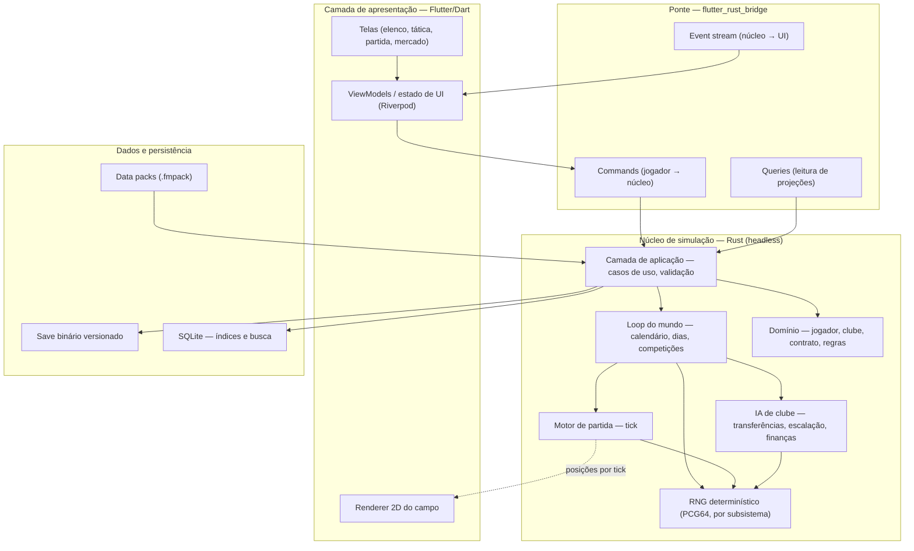

# 02 — Arquitetura

> Princípio que governa tudo abaixo: **o jogo é um núcleo determinístico headless; a
> interface é um cliente descartável desse núcleo.** Se a UI não puder ser jogada fora e
> reescrita sem tocar na simulação, a arquitetura está errada.

---

## 1. Decisão de stack

### 1.1 Escolha

| Camada | Escolha | Papel |
|---|---|---|
| Núcleo de simulação | **Rust** (edição 2021+, `no_std`-friendly onde der) | Regras, motor de partida, IA, persistência |
| Ponte | **flutter_rust_bridge** (FFI gerado) | Chamadas síncronas + streams de eventos |
| Interface | **Flutter** (Dart) | Windows 10/11, Android, iOS — um código |
| Campo 2D | `CustomPainter` sobre Impeller (ou **Flame** se a complexidade crescer) | Visão top-down |
| Persistência | Save binário próprio + **SQLite** (via `rusqlite`) para índices e consultas | Save cross-platform, busca rápida |
| Dados de conteúdo | JSON/TOML validados, empacotados em `.fmpack` (zip) | Data packs, modding |
| Build/CI | Cargo + Flutter + GitHub Actions (matriz Windows/Android/iOS) | Reprodutibilidade |

### 1.2 Por que não as alternativas

| Alternativa | Por que foi descartada |
|---|---|
| **Godot 4 (GDScript/C#)** | Excelente para 2D, fraco exatamente onde este jogo vive: tabelas densas, listas virtualizadas de milhares de linhas, formulários. Construir um framework de UI de dados dentro do Godot custaria mais que o motor de partida. Determinismo cross-platform exigiria disciplina extra sobre o runtime de script. |
| **Unity** | Licenciamento hostil a projeto aberto, runtime pesado para um jogo de listas, mesmo problema de UI de dados. |
| **.NET MAUI / Avalonia** | Ótimo no Windows; mobile (sobretudo iOS) é o elo fraco em performance de listas e tamanho do app. GC em pausas longas atrapalha a simulação em lote. |
| **Tauri 2 (web UI)** | Cobre mobile desde 2024, mas entrega WebView **diferente por plataforma** — três motores de render para depurar, e listas grandes em DOM não alcançam os alvos da RNF-07. |
| **React Native / Kotlin Multiplatform** | RN tem o mesmo problema de listas densas; KMP resolveria o núcleo, mas obrigaria UI nativa separada por plataforma (Compose + SwiftUI + WinUI) — triplica o trabalho de UI. |
| **C++ no núcleo** | Viável e tradicional, mas Rust entrega o mesmo perfil de performance com segurança de memória, `cargo` para dependências e testes/benchmarks de primeira classe — decisivo para um projeto aberto com contribuidores rotativos. |

Registro formal: [ADR 0001](adr/0001-stack.md).

### 1.3 Risco assumido

`flutter_rust_bridge` é a peça de maior risco de manutenção (gera código, acompanha
versões do Flutter). Mitigação: **a superfície da FFI é pequena e estável por contrato**
(§4). Se a ponte se tornar inviável, trocá-la é uma tarefa de semanas — não de meses —
porque o núcleo não conhece Flutter.

---

## 2. Visão em camadas



**Regras de dependência (verificadas por lint em CI):**

* `domínio` não depende de nada (nem de I/O, nem de tempo, nem de RNG global).
* `motor`, `IA` e `mundo` dependem de `domínio` — nunca o inverso.
* Nenhuma crate do núcleo depende de Flutter, Dart ou de qualquer coisa de UI.
* A UI **nunca** contém regra de jogo. Se um cálculo decide algo, mora no Rust.

---

## 3. Organização do código

```
cm0304_open/
├─ core/                         # workspace Rust
│  ├─ domain/                    # tipos puros: Player, Club, Contract, Attributes...
│  ├─ rules/                     # regras de competição dirigidas por dados
│  ├─ engine/                    # motor de partida (tick, eventos, estatísticas)
│  ├─ world/                     # loop do calendário, temporada, progressão, regens
│  ├─ ai/                        # IA de clube: escalação, mercado, finanças
│  ├─ persist/                   # serialização do save, migrações, SQLite
│  ├─ pack/                      # leitura/validação de data packs
│  ├─ app/                       # casos de uso; única fronteira pública do núcleo
│  ├─ ffi/                       # binding gerado + tipos de fronteira
│  └─ cli/                       # binário headless: simular, calibrar, validar
├─ app/                          # Flutter
│  ├─ lib/features/<área>/       # tela + viewmodel por área funcional
│  ├─ lib/design/                # design system, tokens, widgets de dados
│  └─ lib/bridge/                # wrapper gerado + camada de tradução
├─ packs/                        # data packs de referência (abertos)
├─ tools/                        # pipelines de dados, geradores, relatórios
└─ docs/                         # esta documentação + ADRs
```

Tamanho-alvo por crate: nenhuma acima de ~8k linhas. `world` e `ai` são as que tendem a
inchar; dividi-las cedo (`world/season`, `world/progression`, `ai/transfer`, `ai/squad`).

---

## 4. Contrato da fronteira (FFI)

Três verbos apenas. Tudo passa por aqui.

```rust
// core/app — assinaturas conceituais expostas via FFI

/// Muda o estado. Determinístico, validado, registrado no log de comandos.
fn dispatch(cmd: Command) -> Result<CommandReceipt, GameError>;

/// Lê projeções pré-computadas. Nunca muda estado. Nunca aloca no caminho quente.
fn query(q: Query) -> QueryResult;

/// Fluxo de eventos do núcleo para a UI (notícias, gols, fim de processamento).
fn events() -> Stream<GameEvent>;
```

Decisões embutidas nesse contrato:

* **Command/Query separados (CQS).** Todo `Command` é serializável e vai para um log —
  é o que dá replay, reprodução de bug e a base futura de multiplayer.
* **Projeções, não entidades.** A UI recebe `PlayerRow { id, nome, pos, idade, ca_aparente… }`,
  não o agregado `Player`. Evita copiar estruturas grandes pela FFI e mantém a névoa de
  guerra (§7) sob controle do núcleo.
* **Paginação obrigatória** em qualquer consulta que possa retornar > 200 linhas.
* **Zero lógica de jogo em Dart.** Se a UI precisa de um número, existe uma `Query`.

---

## 5. Determinismo

Requisito de produto (RNF-12), detalhado em [ADR 0002](adr/0002-determinismo.md).

| Ameaça | Tratamento |
|---|---|
| Ponto flutuante divergindo entre x86-64 e ARM64 | **Nenhum `f32`/`f64` em caminho que afete estado.** Toda matemática de simulação usa inteiros ou ponto fixo `i32` (escala 1/1000). Float só em interpolação visual. |
| Ordem de iteração de `HashMap` | Proibido iterar mapas não-ordenados em lógica; usar `BTreeMap` ou vetores indexados por id denso. |
| Paralelismo introduzindo não-determinismo | Paralelismo só em partições independentes (ex.: partidas do mesmo dia), com **merge em ordem fixa de id**. |
| RNG global compartilhado | Um `Rng` **por subsistema e por entidade-raiz**, semeado por `hash(seed_mundo, dominio, id, tick)`. Simular a partida A não pode mudar o resultado da partida B. |
| Tempo do sistema / locale | Proibidos no núcleo. Data é do calendário do jogo; formatação é da UI. |
| Mudança de versão alterando resultados | Golden masters em CI (ver [`08`](08-qualidade-e-testes.md#3-golden-masters)); mudança intencional exige bump de versão de simulação e nota. |

Verificação contínua: o CLI expõe `--state-hash`, e a CI compara o hash após N dias
simulados nas três plataformas. Divergência = build vermelho.

---

## 6. Modelo de execução e performance

### 6.1 Layout de memória

Com 250 mil jogadores, "um objeto por jogador com ponteiros" já perde. O núcleo usa
**SoA (structure of arrays) indexado por id denso**:

```rust
struct Players {
    // arrays paralelos; índice = PlayerId (u32 denso)
    ability:      Vec<Ability>,      // ca, pa: u8
    attributes:   Vec<[u8; N_ATTR]>, // 1..=20 empacotado
    condition:    Vec<u8>,
    morale:       Vec<i8>,
    club:         Vec<ClubId>,
    // ... "colunas" frias (histórico, contrato) ficam em tabelas separadas
}
```

Consequências: cache-friendly, serialização quase direta para o save, e a distinção
natural entre **dados quentes** (tocados todo dia — condição, moral, forma) e **frios**
(histórico, carreira) que podem ficar fora da RAM no mobile.

### 6.2 Orçamento de um "dia" simulado

Alvo RNF-02: ≤ 400 ms desktop / ≤ 1,5 s mobile para um dia com 40 países.

| Etapa | Fatia do orçamento |
|---|---|
| Partidas do dia (modo instantâneo, em paralelo por partição) | 45% |
| IA de clube (mercado, escalação, finanças) — amortizada | 25% |
| Progressão (treino, condição, moral, lesões) — em lote SIMD-friendly | 15% |
| Eventos, notícias, índices | 10% |
| Margem | 5% |

Técnicas obrigatórias:

* **Amortização por fatia**: a IA de mercado de 5.000 clubes não roda toda em um dia;
  clubes são distribuídos em *buckets* por dia do calendário (mesmo bucket = mesmo dia,
  determinístico).
* **Nível de detalhe (LOD) por competição**: ligas que o jogador acompanha rodam o motor
  completo; ligas de fundo rodam o motor estatístico (RF-MU-09), ~50× mais barato.
* **Sem alocação no laço quente** — arenas e buffers reaproveitados por tick.
* **Paralelismo por `rayon`** apenas nas partições independentes, com redução ordenada.

### 6.3 Threading

* Thread da UI (Dart) nunca simula. Todo `dispatch` pesado roda em pool no Rust e
  devolve progresso por `events()`.
* Uma partida assistida roda em *tick* de tempo real com passo fixo; a UI interpola as
  posições entre ticks para render suave (o motor não é acoplado ao frame rate).

---

## 7. Névoa de guerra e verdade do mundo

A distinção é estrutural, não cosmética:

* `Player.ability` — **verdade**, só o núcleo enxerga.
* `Knowledge { club_id, player_id, precision, bias, last_seen }` — o que cada clube
  (inclusive o do jogador) sabe.
* Toda `Query` de UI devolve **valores percebidos**, derivados de verdade + conhecimento
  + viés do olheiro, de forma determinística.

Isso impede a classe de bug mais comum do gênero (vazar dado oculto na interface) e
permite que a IA sofra da mesma limitação de informação que o jogador humano — o que é o
que torna o mercado crível.

---

## 8. Persistência

### 8.1 Save

* Formato binário próprio, colunar (espelha o SoA), com **cabeçalho versionado**:
  `magic | schema_version | sim_version | seed | pack_ids+hashes | created_at`.
* Compressão **zstd** por bloco — permite carregar só o que é necessário (RNF-04).
* **Endianness fixa (little)** e tipos de largura explícita ⇒ o mesmo arquivo abre no
  Windows e no Android (RF-PL-02).
* Autosave em **escrita atômica** (arquivo temporário + rename), mantendo N gerações.
* O log de comandos vai junto (comprimido): permite reproduzir bugs e, opcionalmente,
  reconstruir o save.

### 8.2 SQLite

Não guarda a verdade do jogo — guarda **índices derivados** (busca de jogadores,
shortlists, estatísticas históricas). Pode ser reconstruído do save a qualquer momento.
Essa separação evita que consultas de UI ditem o modelo de domínio.

### 8.3 Migração

Cada bump de `schema_version` exige uma função de migração e um teste com um save real
da versão anterior, guardado em `tests/fixtures/saves/`. Sem migração possível ⇒ o jogo
recusa o save com mensagem clara, nunca abre "meio corrompido" (RNF-25).

---

## 9. Assuntos transversais

### 9.1 Configuração dirigida por dados

Regras de competição, curvas econômicas, tabelas de progressão e pesos do motor ficam em
arquivos versionados dentro de `packs/core/`. Trocar "quantos times sobem na Série B" é
edição de dado; recompilar é sinal de erro de arquitetura (RNF-23).

### 9.2 Erros

Núcleo devolve `Result` tipado; `panic` é bug e quebra a CI. Na UI, todo erro de comando
vira mensagem acionável — o jogo nunca perde uma sessão por erro recuperável.

### 9.3 Observabilidade

* `tracing` no Rust com spans por dia/partida, gravável em arquivo local.
* Modo `--profile` no CLI emitindo CSV de tempo por etapa (alimenta os alvos de §6.2).
* Telemetria de produto: **opt-in**, anônima, desligada por padrão (RNF-17).

### 9.4 Hot-seat e o caminho para multiplayer

Vários técnicos humanos no mesmo save (hot-seat) é barato e entra como *Could* no M5.
Multiplayer em rede permanece fora do 1.0, mas o par *log de comandos + determinismo* é
exatamente o substrato de um modelo lockstep — a decisão de hoje não fecha essa porta.

---

## 10. Build, distribuição e CI

| Plataforma | Artefato | Notas |
|---|---|---|
| Windows 10/11 | `.zip` portátil + MSIX | x64 e ARM64; sem exigir admin (RNF-19). Assinatura de código a definir. |
| Android | `.aab` (loja) + `.apk` (GitHub/itch) | ARM64; `minSdk 28`; pack grande via *asset delivery* ou download em primeira execução. |
| iOS | `.ipa` via TestFlight | Requer conta paga; **sem JIT** (Rust AOT resolve); atenção à licença (ver [`05`](05-dados-e-legal.md)). |
| Headless | binário `managerfc-cli` | Usado por CI, balanceamento e modders. |

Pipeline em todo PR: `fmt` → `clippy -D warnings` → testes unitários → testes de
propriedade → **golden masters** → benchmarks com orçamento → build das três plataformas
→ **verificação de hash de estado cruzada entre plataformas**.

---

## 11. Dívida técnica aceita conscientemente

| Dívida | Quando pagar |
|---|---|
| Motor de partida v0 puramente probabilístico (sem espaço) | Substituído no M3 pelo híbrido de [`04`](04-motor-de-partida.md); o contrato de saída (eventos) já nasce no formato final |
| SQLite como índice pode virar gargalo no mobile | Medir no M3; alternativa é índice colunar próprio em memória |
| `flutter_rust_bridge` | Reavaliar no M4 conforme estabilidade das versões |
| UI do editor pré-jogo só no desktop no M4 | Mobile no M5, se houver demanda real |
