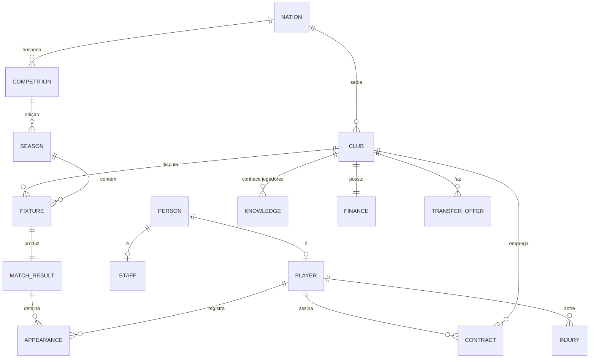

# 03 — Modelo de dados

Modelo de domínio, escalas numéricas, esquema de persistência e formato de *data pack*.
Tudo aqui é **nosso**: nenhuma estrutura, campo ou valor foi derivado de arquivos do jogo
original (ver [`05`](05-dados-e-legal.md)).

---

## 1. Visão do domínio



Agregados (fronteiras de consistência):

| Agregado | Raiz | Invariante principal |
|---|---|---|
| **Jogador** | `PlayerId` | Soma ponderada dos atributos é consistente com CA (§5) |
| **Clube** | `ClubId` | Folha salarial ≤ receita projetada + caixa; elenco dentro de limites de inscrição |
| **Competição** | `CompetitionId` | Todo clube inscrito joga o número correto de partidas |
| **Temporada** | `SeasonId` | Calendário sem conflito de data/estádio para o mesmo clube |
| **Transferência** | `OfferId` | Uma oferta só existe com orçamento reservado |

---

## 2. Identificadores

* Todos os ids são `u32` **densos** (índice direto em array), atribuídos na carga do pack.
* Ids **externos estáveis** (string, ex.: `br.sp.corinthians`) existem só nos data packs e
  na camada de import/export — nunca no caminho quente.
* Mapeamento externo→interno é reconstruído na carga e faz parte do save (para que packs
  atualizados não embaralhem uma carreira em andamento).

---

## 3. Pessoa, jogador, staff

```rust
struct Person {
    first_name: StrId, last_name: StrId, common_name: Option<StrId>,
    birth: GameDate,
    nationalities: SmallVec<[NationId; 2]>,
    // dados factuais; nenhum retrato ou asset de imagem
}

struct Player {
    person: PersonId,
    ability: Ability,              // ca, pa — ocultos (0..=200)
    attrs: [u8; N_ATTR],           // visíveis, 1..=20
    hidden: [u8; N_HIDDEN],        // ocultos, 1..=20
    positions: [u8; N_POS],        // familiaridade por posição, 0..=20
    foot: (u8, u8),                // habilidade pé direito / esquerdo, 1..=20
    condition: u8,                 // 0..=100
    sharpness: u8,                 // ritmo de jogo, 0..=100
    morale: i8,                    // -100..=100
    form: i8,                      // média móvel de desempenho
    status: PlayerStatus,          // ativo, lesionado, suspenso, aposentado
}
```

### 3.1 Atributos visíveis (`N_ATTR = 36`)

| Grupo | Atributos |
|---|---|
| **Técnicos (14)** | finalização, cabeceio, passe, cruzamento, drible, controle de bola, desarme, marcação, chute de longe, bola parada, pênaltis, lançamento, domínio, técnica |
| **Mentais (12)** | visão de jogo, decisão, posicionamento, antecipação, concentração, determinação, liderança, trabalho de equipe, agressividade, frieza, criatividade, sem bola |
| **Físicos (6)** | ritmo, aceleração, resistência, força, agilidade, equilíbrio |
| **Goleiro (4)** | reflexos, saída do gol, jogo aéreo, jogo com os pés |

Atributos de goleiro só contam no cálculo de CA se a familiaridade em GOL ≥ 10 — é o
que evita o clássico "zagueiro com CA inflado por atributos inúteis".

### 3.2 Atributos ocultos (`N_HIDDEN = 10`)

consistência · jogo importante · sujeira · lealdade · ambição · profissionalismo ·
temperamento · pressão · adaptabilidade · propensão a lesão

Nunca expostos numericamente na UI — aparecem como texto de relatório de olheiro
("tende a desaparecer em jogos grandes"), com precisão dependente do conhecimento (§6).

---

## 4. Escalas numéricas — regra única

| Conceito | Escala | Visível? |
|---|---|---|
| Atributo | 1–20 (`u8`) | sim |
| CA / PA | 0–200 (`u8`) | **não** |
| Condição, ritmo de jogo | 0–100 | sim (ícone/barra) |
| Moral | −100…+100 | sim (rótulo, não número) |
| Reputação (jogador, clube, competição, país) | 0–10000 | não (rótulo) |
| Dinheiro | `i64` em **centavos** da moeda base; câmbio por data | sim |
| Probabilidades e pesos do motor | ponto fixo `i32`, escala 1/1000 | não |

**Nenhum ponto flutuante em dado persistido ou em cálculo que afete estado** (RNF-12).
Essa é a regra que mantém o save idêntico entre x86-64 e ARM64.

---

## 5. CA, PA e o custo de atributos

O sistema que dá coerência ao mundo inteiro. Conceito próprio, inspirado no gênero:

```
CA = clamp( Σ_i peso(posição, atributo_i) × valor_i  /  K_posição , 1, 200 )
```

* `peso(posição, atributo)` vem de uma **tabela de dados** (`packs/core/ability.toml`),
  não de código — ajustável em balanceamento sem recompilar.
* `K_posição` normaliza para que um lateral de CA 150 e um atacante de CA 150 sejam
  igualmente úteis aos seus times.
* **Invariante**: ao aumentar um atributo, o motor de progressão precisa "pagar" com CA
  disponível; sem CA sobrando, subir um atributo **baixa outro**. É isso que produz
  jogadores especializados e impede inflação com o passar das temporadas.
* PA pode ser **fixo** (ex.: 170) ou **faixa** (`-8` = "entre 140 e 180, sorteado na
  criação"). A faixa é resolvida na criação do save, não durante a carreira.

### 5.1 Progressão (resumo; detalhe de calibração em [`08`](08-qualidade-e-testes.md))

```
ΔCA_mês = f( idade, (PA − CA), treino, minutos_jogados,
             profissionalismo, ambição, qualidade_do_clube, moral )
```

Curva por idade (ponto de partida para calibração, ajustável em dados):

| Faixa | Comportamento |
|---|---|
| 15–18 | ganho alto, muito sensível a minutos e treino |
| 19–23 | ganho moderado; jogar é mais importante que treinar |
| 24–28 | platô; ganho marginal, atributos mentais ainda sobem |
| 29–32 | declínio físico, ganho mental compensa parcialmente |
| 33+ | declínio acelerado; físico cai primeiro, técnica por último |

---

## 6. Conhecimento (névoa de guerra)

```rust
struct Knowledge {
    club: ClubId, player: PlayerId,
    precision: u8,        // 0..=100 — quão perto do valor real
    bias: i8,             // viés do olheiro que reportou
    last_seen: GameDate,  // conhecimento decai com o tempo
}
```

Valor percebido é sempre derivado, **determinístico** e calculado no núcleo:

```
percebido(atributo) = real + ruido_deterministico(seed, clube, jogador, atributo, precisao) + bias
```

Com `precision = 100` o ruído é zero (jogador do próprio elenco, observado há meses).
Com `precision` baixa, a UI mostra faixa (`12–16`) em vez de número.

---

## 7. Data packs

Formato aberto, versionado, é **a** interface de conteúdo do jogo (RF-DM-01).

```
meu_pack.fmpack (zip)
├─ pack.toml                 # id, nome, versão, dependências, licença dos dados
├─ nations/*.json
├─ competitions/*.json       # regras dirigidas por dados
├─ clubs/*.json
├─ people/*.json             # jogadores e staff
├─ rules/*.toml              # tabelas de progressão, economia, pesos do motor
├─ names/*.json              # dicionários de nomes por país (para regens)
└─ cosmetics/                # opcional, separado: escudos SVG, cores, apelidos
```

Exemplo de regra de competição (o ponto é que **tudo** é dado):

```json
{
  "id": "br.serie_a",
  "name": "Primeira Divisão (Brasil)",
  "nation": "br",
  "tier": 1,
  "format": { "type": "round_robin", "legs": 2, "teams": 20 },
  "tiebreakers": ["points", "wins", "goal_difference", "goals_for", "head_to_head"],
  "promotion": { "to": null, "slots": 0 },
  "relegation": { "to": "br.serie_b", "slots": 4 },
  "qualifies": [
    { "to": "conmebol.libertadores", "positions": [1, 2, 3, 4], "stage": "groups" },
    { "to": "conmebol.sudamericana", "positions": [5, 6, 7, 8], "stage": "r1" }
  ],
  "squad_rules": { "max_foreign_on_pitch": 5, "min_homegrown": 0, "max_squad": 50 },
  "calendar": { "start": "04-10", "end": "12-05", "midweek_rounds": true }
}
```

Regras do formato:

* **Versionado por semver**; o jogo recusa pack de `major` incompatível com mensagem clara.
* **Validador obrigatório** (`managerfc-cli pack validate`) roda também em CI dos packs oficiais.
* **Licença declarada** no `pack.toml`; packs de cosmético ficam sempre separados dos de
  regra, porque têm perfil jurídico diferente ([`05`](05-dados-e-legal.md)).
* Conflito entre packs ativos é resolvido por ordem declarada + regra determinística de
  precedência (último vence por campo, nunca por arquivo inteiro).

---

## 8. Esquema de persistência

### 8.1 Save (binário colunar)

```
[header]  magic "CM0304OPEN" | schema_version u16 | sim_version u16
          | world_seed u64 | pack_manifest (ids + hashes) | created/updated
[blocos]  cada bloco = { tipo, contagem, codificação, payload zstd }
          people | players_hot | players_cold | clubs | contracts
          | competitions | fixtures | results | knowledge | finance
          | inbox | command_log
[footer]  checksum xxh3 de cada bloco + índice de offsets
```

*Hot* vs *cold* existe para o mobile: abrir um save carrega os blocos quentes; histórico
e carreira entram sob demanda (RNF-04, RNF-08).

### 8.2 SQLite (índices derivados, descartáveis)

```sql
CREATE TABLE idx_player (
  player_id     INTEGER PRIMARY KEY,
  club_id       INTEGER,
  nation_id     INTEGER,
  position_mask INTEGER,        -- bitmask de posições jogáveis
  age           INTEGER,
  perceived_ca  INTEGER,        -- já filtrado pela névoa de guerra do clube do usuário
  value_cents   INTEGER,
  contract_end  INTEGER,
  search_name   TEXT COLLATE NOCASE
);
CREATE INDEX ix_player_scout ON idx_player(position_mask, age, perceived_ca DESC);
CREATE VIRTUAL TABLE fts_person USING fts5(search_name, content='idx_player');
```

Reconstruível a qualquer momento a partir do save — se corromper, apaga e regenera.

---

## 9. Volumetria alvo

| Entidade | Quantidade (base completa) | Bytes/registro (quente) | Total |
|---|---|---|---|
| Pessoas | 300.000 | ~40 | 12 MB |
| Jogadores | 250.000 | ~80 | 20 MB |
| Clubes | 25.000 | ~200 | 5 MB |
| Contratos | 280.000 | ~48 | 13 MB |
| Partidas/temporada | ~120.000 | ~64 | 8 MB |
| Conhecimento | esparso, ~2 M linhas após 5 temporadas | ~10 | 20 MB |
| **Total quente** | | | **≈ 80 MB** → ~25 MB com zstd |

Confirma a viabilidade de RNF-08 (≤ 600 MB no mobile) com folga para índices e UI.

---

## 10. Origem dos dados

Resumo — detalhe e análise jurídica em [`05`](05-dados-e-legal.md).

| Camada | Fonte | Licença |
|---|---|---|
| Estruturas (países, ligas, formatos) | openfootball, Wikidata, curadoria própria | CC0 / domínio público |
| Clubes (nome, fundação, estádio, cidade) | openfootball, Wikidata | CC0 / CC-BY-SA |
| Jogadores (nome, nascimento, nacionalidade, clube) | Wikidata + curadoria comunitária | CC0 (fatos) |
| **Atributos 1–20** | **gerados** por pipeline estatístico + curadoria da comunidade | CC0 (obra nossa) |
| Cosméticos (escudos, cores) | gerados proceduralmente (SVG) ou pack do usuário | CC0 / do autor |

Os atributos são **obra original do projeto**: derivam de estatísticas públicas e de
votação da comunidade, nunca de extração de bases de terceiros.
