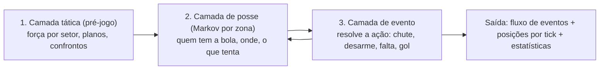

# 04 — Motor de partida

O motor é o coração do produto e a maior fonte de risco. Este documento define **o que
ele é, o que ele não tenta ser, como é calibrado e quanto pode custar**.

> Leitura complementar: [`10-referencias-motores.md`](10-referencias-motores.md) analisa,
> a partir de material público, como o motor do Championship Manager 03/04 e o do
> Elifoot 98 funcionavam — e, principalmente, **os dois exploits históricos** ("Diablo"
> no CM 03/04, "5-0-5" no Elifoot) que justificam a suíte anti-exploit da §4.3.

---

## 1. Posição de projeto

> O motor é um **simulador probabilístico de eventos com verniz espacial** — não uma
> simulação física de 22 agentes. Ele precisa produzir estatísticas críveis, narrativa
> legível e uma visão 2D coerente; não precisa (e não deve) modelar trajetória de bola.

Três consequências diretas:

1. **Tática precisa importar mais que "ratings".** Se escalar o time de maior CA sempre
   vence, o jogo acabou.
2. **Precisa rodar em três regimes** com o **mesmo modelo** por baixo, para que o
   resultado não dependa de o usuário estar assistindo:
   * *instantâneo* (ligas de fundo, ~1,5 ms/partida);
   * *comentado* (texto ao vivo);
   * *assistido* (2D top-down, com posições por tick).
3. **Determinismo antes de realismo.** Um motor não-determinístico é impossível de
   calibrar, de testar e de depurar em um mundo com 120 mil partidas por temporada.

---

## 2. Arquitetura em três camadas



### 2.1 Camada tática — calculada uma vez por partida (e a cada mudança)

Produz vetores por setor a partir de escalação, instruções, atributos, condição, moral,
familiaridade posicional, entrosamento e confronto direto:

```
setores = { defesa, meio_defensivo, meio, meio_ofensivo, ataque } × { esquerda, centro, direita }
força(setor, fase) = Σ contribuição(jogador) × cobertura_posicional × condição × forma
modificadores = mentalidade, largura, linha, pressão, ritmo, mando, clima, arbitragem
```

Saída: matriz de **probabilidades de transição por zona** e **modificadores de evento**.
É aqui que a tática vira número — e é aqui que a maior parte do balanceamento acontece.

### 2.2 Camada de posse — cadeia de Markov espacial

Campo dividido em **18 zonas** (6 faixas × 3 corredores). O estado é
`(zona, time_com_posse, pressão, fase)`. A cada tick sorteia-se a transição:

| Transição | Determinada por |
|---|---|
| progredir (passe/condução) | passe, visão, criatividade do portador × marcação/antecipação do setor adversário |
| manter posse | controle de bola, trabalho de equipe, ritmo escolhido |
| perder posse | desarme/interceptação, agressividade, pressão |
| finalizar | posição da zona, decisão, instrução de finalizar de longe |
| falta / bola parada | agressividade, sujeira, perfil do árbitro |

Modelo Markov por zona é a abordagem usada na literatura de análise de futebol para
modelar cadeias de posse; aqui ela é invertida — em vez de estimar a partir de dados,
**gera** a partida a partir dos parâmetros táticos, e as mesmas métricas (xG, xT) servem
de alvo de calibração.

### 2.3 Camada de evento — resolve a ação

Cada evento é resolvido com **comparação ponderada** entre atacante e defensor, com
ruído determinístico:

```
p_gol = base(zona, tipo_de_chute)
      × f(finalização, frieza, pé, ângulo, pressão)
      ÷ g(goleiro: reflexos, posicionamento, jogo aéreo)
      × modificadores (clima, moral, jogo importante × atributo oculto)
```

Produz: gol, defesa, trave, para fora, escanteio, lesão, cartão, pênalti, substituição
forçada — cada um emitindo um `MatchEvent` tipado.

### 2.4 Posições para o 2D

O motor **não** simula 22 corpos. Ele mantém, por tick, a **formação esperada** de cada
time deslocada pela zona da bola e pela mentalidade, e coloca 2–4 jogadores "relevantes"
perto do evento em curso. A UI interpola entre ticks.

É exatamente o que o 2D top-down clássico faz sentir como real — e custa ~2% do tempo de
CPU de uma simulação física.

---

## 3. Os três regimes

| Regime | Tick | Custo alvo | Uso |
|---|---|---|---|
| **Estatístico (LOD baixo)** | partida inteira em 1 passo | ≤ 0,05 ms | ligas de fundo não carregadas em detalhe |
| **Instantâneo** | 90 ticks (1/min) | ≤ 1,5 ms desktop / 6 ms mobile | resto do mundo, "ir para o fim" |
| **Assistido** | 5.400 ticks (1/s) | ≤ 15 ms/tick amortizado | partida do usuário, 2D e texto |

**Requisito crítico**: instantâneo e assistido usam o **mesmo modelo** e a **mesma seed**;
mudar o regime altera a granularidade do relato, **não** o resultado. Sem isso, o jogador
descobre em uma semana que "assistir dá mais sorte" — e o jogo perde credibilidade.
Teste automatizado: o mesmo `fixture` simulado nos dois regimes converge em placar e
estatísticas principais (tolerância zero para placar, ±5% para posse/finalizações).

---

## 4. Calibração

### 4.1 Alvos (futebol europeu de primeira divisão, médias recentes)

| Métrica | Alvo | Tolerância em CI |
|---|---|---|
| Gols por partida | 2,7 | ±0,15 |
| Vitórias do mandante | 44% | ±3 p.p. |
| Empates | 25% | ±3 p.p. |
| Finalizações por time | 12,5 | ±1,5 |
| Conversão de finalizações | 10,5% | ±1,5 p.p. |
| Posse do vencedor (média) | 53% | ±3 p.p. |
| Cartões amarelos/jogo | 3,8 | ±0,6 |
| Vermelhos/jogo | 0,10 | ±0,05 |
| Placares 0×0 | 8% | ±2 p.p. |
| Lesões por 1.000 min | 3,0 | ±1,0 |
| Correlação CA médio × pontos na temporada | 0,75–0,88 | fora ⇒ falha |

A última linha é a mais importante: **correlação alta demais** significa que a tática não
importa; **baixa demais** significa que o jogo é aleatório. É a métrica que mantém o
motor honesto.

### 4.2 Método

1. `managerfc-cli calibrate --seasons 20 --seed N` roda temporadas headless e emite CSV.
2. Comparação com dados públicos (ex.: séries históricas de resultados de ligas abertas).
3. Ajuste **em dados** (`packs/core/engine.toml`), nunca em código.
4. Golden masters recongelados **apenas** com bump de `sim_version` e nota de release.

### 4.3 Anti-exploit (a lição mais cara do gênero)

Todo manager clássico acabou com uma "tática milagrosa" — e o CM 03/04 ficou famoso por
bugs de mercado e de evolução. Prevenção como parte do processo, não como correção:

* **Torneio automatizado de táticas** em CI: ~40 táticas candidatas (incluindo extremos:
  5 atacantes, ultradefensiva, todos com instrução de chute de longe) jogam round-robin
  com elencos idênticos. Se alguma passar de **62% de aproveitamento**, a build falha.
* **Fuzzing de escalação**: escalações ilegais/absurdas (goleiro no ataque, 3 jogadores
  fora de posição) não podem superar a escalação equilibrada.
* **Sanidade de mercado**: nenhum jogador pode ser comprado por < 25% do valor calculado
  sem justificativa contratual; teste percorre 10 temporadas procurando outliers.
* **Sanidade de progressão**: distribuição de CA do mundo após 10 temporadas precisa se
  manter dentro de ±10% da inicial (sem inflação nem colapso de qualidade).

---

## 5. Contrato de saída

```rust
enum MatchEvent {
    KickOff { half: u8 },
    Possession { tick: u32, zone: Zone, team: Side, carrier: PlayerId },
    Shot  { tick: u32, player: PlayerId, xg_milli: u16, outcome: ShotOutcome },
    Goal  { tick: u32, scorer: PlayerId, assist: Option<PlayerId>, kind: GoalKind },
    Foul  { tick: u32, by: PlayerId, on: PlayerId, card: Option<Card> },
    Injury{ tick: u32, player: PlayerId, severity: Severity },
    Sub   { tick: u32, off: PlayerId, on: PlayerId, reason: SubReason },
    Positions { tick: u32, frame: PositionFrame },   // só no regime assistido
    FullTime { stats: MatchStats, ratings: Vec<(PlayerId, u8)> },
}
```

* O **texto** do comentário não está no evento: é a UI que traduz `MatchEvent` para a
  língua do usuário (RF-PL-06). Evento é dado; narração é apresentação.
* O mesmo fluxo alimenta os três regimes, o replay (RF-PA-09) e os testes.
* `xg_milli` é o gancho natural de calibração e de estatística pós-jogo.

---

## 6. Orçamento de CPU (regime instantâneo, desktop de referência)

| Etapa | Alvo |
|---|---|
| Camada tática (1×/partida) | 250 µs |
| 90 ticks de posse | 600 µs |
| Resolução de eventos (~250/partida) | 400 µs |
| Estatísticas, notas, relatório | 150 µs |
| **Total** | **≈ 1,4 ms** |

Com ~330 partidas por dia de calendário em 40 países e paralelismo de 4 threads:
≈ 115 ms — dentro da fatia de 45% do orçamento diário de RNF-02.

---

## 7. Plano evolutivo

| Versão | Marco | Conteúdo |
|---|---|---|
| **v0** | M1 | Só camada estatística (força relativa → placar). Destrava mundo, calendário e IA. |
| **v1** | M2 | Camadas de posse + evento; regime instantâneo e comentado; primeira calibração. |
| **v2** | M3 | Regime assistido, posições, 2D, bolas paradas, instruções por jogador, fadiga intra-jogo. |
| **v3** | M4 | Clima, arbitragem, entrosamento, jogo importante, torneio anti-exploit em CI. |
| **v4** | pós-1.0 | Pesos aprendidos a partir de dados abertos de eventos, mantendo determinismo. |

O contrato de `MatchEvent` nasce completo na v0 (com campos não preenchidos), para que a
UI, os testes e os replays nunca precisem ser reescritos quando o motor evoluir.
