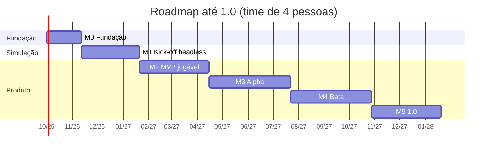
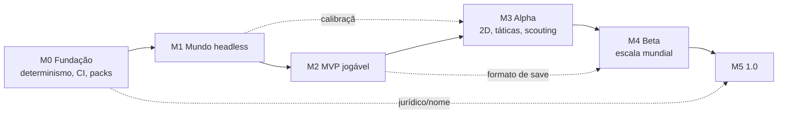

# 07 — Roadmap, equipe e custo

Estimativas em **semanas-pessoa**, para um time de referência de **4 pessoas**
(2 Rust/simulação, 1 Flutter/UI, 1 dados+game design, com QA distribuído). A coluna
"solo" mostra o mesmo escopo em regime de hobby (~12 h/semana).

---

## 1. Linha do tempo

| Marco | Duração | Semanas-pessoa | Solo (~12h/sem) | Portão de saída |
|---|---|---|---|---|
| M0 | 6 sem | 18 | ~4 meses | CI verde nas 3 plataformas + ADRs aprovadas |
| M1 | 10 sem | 38 | ~7 meses | Temporada headless com calibração dentro da tolerância |
| M2 | 12 sem | 46 | ~9 meses | **Critério de MVP** de [`00`](00-escopo.md#7-mvp--a-menor-coisa-que-prova-a-tese) |
| M3 | 14 sem | 54 | ~10 meses | 10 temporadas estáveis; torneio anti-exploit verde |
| M4 | 14 sem | 54 | ~10 meses | 40 países dentro dos orçamentos de performance |
| M5 | 12 sem | 44 | ~8 meses | Checklist de publicação de [`05`](05-dados-e-legal.md#8-checklist-antes-de-qualquer-publicação) |
| **Total** | **68 sem** | **254** | **~4 anos** | ≈ **16 meses** com 4 pessoas |

Os números de "solo" existem para deixar explícito: **em regime de hobby individual, o
escopo de 1.0 é irreal**. Nesse cenário, o alvo honesto é parar no M3 e tratar M4/M5 como
trabalho da comunidade.

---

## 2. Detalhe por marco

### M0 — Fundação (6 semanas)

**Objetivo:** tornar todo o resto mensurável.

* Workspace Rust + app Flutter + ponte funcionando com um `dispatch` trivial
* CI: `fmt`, `clippy -D warnings`, testes, build Windows/Android/iOS
* RNG determinístico, tipos de ponto fixo, `GameDate`, ids densos
* Carregador de data pack + validador + 1 país de exemplo (2 divisões)
* ADRs 0001–0004 aprovadas; nome do produto verificado (busca de marca)
* Harness de benchmark com orçamentos já falhando em vermelho (metas de RNF)

**Portão:** `managerfc-cli pack validate` e `managerfc-cli bench` rodando nas 3 plataformas em CI.

### M1 — Kick-off headless (10 semanas)

**Objetivo:** um mundo que gira sozinho, sem uma única tela.

* Motor v0 (estatístico) com contrato `MatchEvent` completo
* Calendário, temporada, tabela, copa, promoção/rebaixamento
* Progressão de jogadores (CA/PA, idade, condição), lesões simples, suspensões
* IA de escalação e primeira IA de mercado
* `calibrate` emitindo CSV; primeiras tolerâncias em CI
* Golden masters congelados

**Portão:** 20 temporadas seguidas sem divergência entre plataformas e com métricas de
[`04`](04-motor-de-partida.md#41-alvos-futebol-europeu-de-primeira-divisão-médias-recentes) dentro da tolerância.

### M2 — MVP jogável (12 semanas)

**Objetivo:** responder se o loop é divertido. Ver critérios em [`00`](00-escopo.md#7-mvp--a-menor-coisa-que-prova-a-tese).

* Shell de UI, navegação, `DataTable` virtualizada, design tokens
* Telas: início/caixa de entrada, elenco, jogador, tática, tabela, calendário, mercado
* Motor v1 (posse + eventos) e partida em modo texto ao vivo
* Transferências jogáveis, contratos, treino básico
* Save binário cross-platform + autosave + 3 slots
* Builds distribuíveis de Windows e Android

**Portão:** os 4 critérios de MVP. **Se o critério 1 (diversão) falhar, o projeto para
aqui e volta ao design** — é para isso que o marco existe.

### M3 — Alpha (14 semanas)

* Motor v2: regime assistido, posições, **visão 2D**, bolas paradas, fadiga intra-jogo
* Táticas completas (instruções por jogador, marcação individual, planos alternativos)
* Treino detalhado + comissão técnica
* Scouting com névoa de guerra e rede de olheiros
* Regens, aposentadoria, evolução calibrada em 10 temporadas
* Diretoria, metas, demissão, busca de emprego
* Build iOS via TestFlight; primeiro teste fechado (~50 pessoas)

**Portão:** 10 temporadas com distribuição de CA estável (±10%) e torneio anti-exploit
sem tática acima de 62% de aproveitamento.

### M4 — Beta (14 semanas)

* 40+ países, 100+ divisões, competições continentais, seleções
* Base completa (~250k jogadores) dentro dos orçamentos de RNF-02/04/08 **no mobile**
* Editor pré-jogo (desktop) + import/export CSV/JSON
* Economia de longo prazo (inflação de mercado em 20 temporadas)
* Imprensa, conversas com elenco, empréstimos, pré-contratos
* Beta aberto; instrumentação opt-in para balanceamento

**Portão:** orçamentos de performance verdes no aparelho mobile de referência com base
completa carregada.

### M5 — 1.0 (12 semanas)

* Modding: múltiplos packs, packs cosméticos, documentação do formato
* Localização PT-BR/EN/ES completa; acessibilidade (RF-PL-07)
* Polimento: atalhos, estados vazios, mensagens de erro, primeira sessão
* Empacotamento: MSIX, AAB, IPA; páginas de loja; checklist jurídico
* Estabilização: 2 semanas de *bug bash* sem features novas

**Portão:** checklist de publicação de [`05`](05-dados-e-legal.md#8-checklist-antes-de-qualquer-publicação) completo.

---

## 3. Pós-1.0 (não comprometido)

Ordem sugerida por relação valor/custo: hot-seat local → estatísticas históricas
avançadas → modo desafio/cenários → mais idiomas → pesos do motor refinados com dados
abertos → build web (WASM) → avaliação de multiplayer.

---

## 4. Equipe

| Papel | Alocação | Responsabilidade |
|---|---|---|
| Eng. de simulação (Rust) × 2 | integral | Núcleo, motor, IA, performance, determinismo |
| Eng. de cliente (Flutter) × 1 | integral | UI, 2D, ponte, empacotamento |
| Dados + game design × 1 | integral | Pipeline de ratings, packs, calibração, balanceamento |
| QA / release | ~0,5 | Automação de testes, builds, testes em aparelhos |
| Jurídico (externo) | pontual | Revisão de marca e de dados antes do M5 |

Fator de ônibus: **nenhuma área pode ter dono único**. Rotação obrigatória de revisão de
PR entre núcleo e UI.

---

## 5. Custo indicativo

Cenário A — time contratado (referência Brasil, 16 meses):

| Item | Estimativa |
|---|---|
| 4 pessoas × 16 meses | principal custo do projeto |
| Aparelhos de teste (3 Android, 2 iOS, 1 PC de referência baixa) | R$ 15–25 mil |
| Conta Apple Developer (2 anos) + Google Play (único) | ~R$ 1,5 mil |
| Revisão jurídica de PI | R$ 8–20 mil |
| Infra (CI com runners macOS, armazenamento) | R$ 300–800/mês |
| Steam (opcional, pós-1.0) | US$ 100/produto |

Cenário B — comunidade aberta: custo direto cai para infraestrutura + jurídico
(R$ 10–25 mil no total), e o cronograma passa a depender de retenção de contribuidores —
que é o risco real, não o dinheiro (ver [`09`](09-riscos.md)).

---

## 6. Dependências entre marcos

Caminho crítico: **M0 → M1 → M2**. Tudo que não estiver nesse caminho (2D, imprensa,
editor, localização) é deliberadamente adiado — é a única forma de chegar cedo à pergunta
que importa: *o jogo é bom?*

---

## 7. Como o escopo é cortado sob pressão

Ordem de corte pré-acordada, para não virar discussão no meio do aperto:

1. Cortar **países** (40 → 12) — preserva a experiência, reduz dados e custo de calibração
2. Cortar **imprensa e conversas** (RF-CA-04/05)
3. Cortar **editor no jogo** (mantém CLI + edição de arquivos)
4. Cortar **iOS do 1.0** (Windows + Android primeiro)
5. Cortar **localização** para PT-BR + EN

Nunca cortáveis: determinismo, save cross-platform, calibração do motor, névoa de guerra.
São o que diferencia o produto e o que é caro demais para retrofitar.
