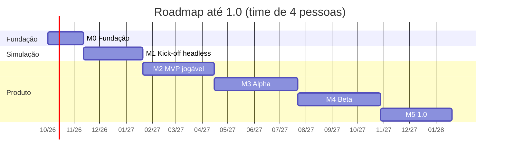
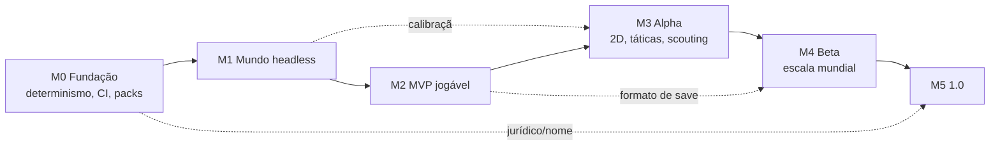

# 07 — Roadmap, equipe e custo

Estimativas em **semanas-pessoa**, para um time de referência de **4 pessoas**
(2 Rust/simulação, 1 Flutter/UI, 1 dados+game design, com QA distribuído). A coluna
"solo" mostra o mesmo escopo em regime de hobby (~12 h/semana).

---

## 1. Linha do tempo

```mermaid
gantt
    title Roadmap até 1.0 (time de 4 pessoas)
    dateFormat  YYYY-MM-DD
    axisFormat  %m/%y
    section Fundação
    M0 Fundação            :m0, 2026-10-01, 6w
    section Simulação
    M1 Kick-off headless   :m1, after m0, 10w
    section Produto
    M2 MVP jogável         :m2, after m1, 12w
    M3 Alpha               :m3, after m2, 14w
    M4 Beta                :m4, after m3, 14w
    M5 1.0                 :m5, after m4, 12w
```

| Marco | Duração | Semanas-pessoa | Solo (~12h/sem) | Portão de saída |
|---|---|---|---|---|
| M0 | 6 sem | 18 | ~4 meses | CI verde nas 3 plataformas + ADRs aprovadas |
| M1 | 10 sem | 38 | ~7 meses | Temporada headless com calibração dentro da tolerância |
| M2 | 12 sem | 46 | ~9 meses | **Critério de MVP** de [`00`](00-escopo.md#7-mvp--a-menor-coisa-que-prova-a-tese) |
| M3 | 14 sem | 54 | ~10 meses | 10 temporadas estáveis; torneio anti-exploit verde |
| M4 | 14 sem | 54 | ~10 meses | 40 países dentro dos orçamentos de performance |
| M5 | 12 sem | 44 | ~8 meses | Checklist de publicação de [`05`](05-dados-e-legal.md#8-checklist-antes-de-qualquer-publicação) |
| **Total** | **68 sem** | **254** | **~4 anos** | ≈ **16 meses** com 4 pessoas |

Os números de "solo" existem para deixar explícito: **em regime de hobby individual, o
escopo de 1.0 é irreal**. Nesse cenário, o alvo honesto é parar no M3 e tratar M4/M5 como
trabalho da comunidade.

---

## 2. Detalhe por marco

### M0 — Fundação (6 semanas)

**Objetivo:** tornar todo o resto mensurável.

* Workspace Rust + app Flutter + ponte funcionando com um `dispatch` trivial
* CI: `fmt`, `clippy -D warnings`, testes, build Windows/Android/iOS
* RNG determinístico, tipos de ponto fixo, `GameDate`, ids densos
* Carregador de data pack + validador + 1 país de exemplo (2 divisões)
* ADRs 0001–0004 aprovadas; nome do produto verificado (busca de marca)
* Harness de benchmark com orçamentos já falhando em vermelho (metas de RNF)

**Portão:** `managerfc-cli pack validate` e `managerfc-cli bench` rodando nas 3 plataformas em CI.

### M1 — Kick-off headless (10 semanas)

**Objetivo:** um mundo que gira sozinho, sem uma única tela.

* Motor v0 (estatístico) com contrato `MatchEvent` completo
* Calendário, temporada, tabela, copa, promoção/rebaixamento
* Progressão de jogadores (CA/PA, idade, condição), lesões simples, suspensões
* IA de escalação e primeira IA de mercado
* `calibrate` emitindo CSV; primeiras tolerâncias em CI
* Golden masters congelados

**Portão:** 20 temporadas seguidas sem divergência entre plataformas e com métricas de
[`04`](04-motor-de-partida.md#41-alvos-futebol-europeu-de-primeira-divisão-médias-recentes) dentro da tolerância.

> **Estado de implementação do próprio portão:** as duas metades já são
> verificadas de verdade, mas por testes separados — `golden verify` (`docs/08
> §3`) cobre "sem divergência entre plataformas" (3 temporadas, nas 3 famílias
> de SO da CI) e `calibrate --check` (`docs/04 §4.2`) cobre "métricas dentro
> da tolerância" (50 temporadas) — nenhum dos dois roda 20 temporadas pela
> fronteira real de carreira (`app::GameSession`: mercado, lesões, condição,
> progressão, copa e liga, todos juntos). `app::session::tests::vinte_temporadas_seguidas_nao_travam_e_preservam_os_invariantes_do_mundo`
> (novo) fecha essa lacuna: roda exatamente as 20 temporadas do portão pela
> fronteira completa e confere que nada degenera silenciosamente ao longo do
> caminho — dinheiro sempre conservado, CA nunca passa do potencial, elenco
> nunca cresce/encolhe, ligas nunca desbalanceiam, copa sempre produz um
> campeão. Não é o mesmo que "golden verify a 20 temporadas" (isso exigiria
> gravar um golden master de 20 temporadas, bem mais caro de manter do que as
> 3 atuais) — é a prova de que o mundo *aguenta* 20 temporadas, não de que o
> resultado bate byte a byte entre plataformas nessa duração.

> **Estado de implementação:** o crate `world` já faz o essencial deste marco
> para uma competição de exemplo — calendário (`rules::round_robin`), tabela
> com desempate (`rules::compute_table`) e promoção/rebaixamento entre
> temporadas, tudo consumindo o motor (v0.5 agora — ver `docs/04`, finalização
> vs. goleiro decide conversão, não só a força bruta) e testado com
> `world::run_seasons` contra o pack de exemplo do M0. `managerfc-cli
> calibrate` já roda e imprime as 5 métricas mensuráveis (gols/partida, %
> de vitória do mandante, % de empate, finalizações/time, % de conversão)
> contra os alvos de `docs/04 §4.1`, com `--check` (falha se alguma sair
> da tolerância — é o item "primeiras tolerâncias em CI" deste marco,
> agora real no job `cli-gate`) e `--csv` (acrescenta uma linha por
> rodada). Números contra o pack de exemplo, 200 temporadas: ~2,65
> gols/partida, ~44% de vitórias do mandante, ~12,5 finalizações/time,
> ~10,5% de conversão — todas dentro da tolerância, não mais na borda:
> `HOME_ADVANTAGE` (motor) foi recalibrado de 1,4 para 1,25 depois que
> `--check` expôs que o valor herdado do v0 deixava o mandante fora da
> faixa com o motor v0.5 (`docs/04 §4.1`, nota de implementação). `pack` agora também
> carrega `people/*.json` (`docs/03 §3`/`§7`) —
> jogadores de verdade, com atributos e CA/PA — e `world::strength_from_squad`
> usa a média de CA do elenco declarado como força do clube, com o sorteio
> sintético (`world::strength`) só de *fallback* para clubes sem elenco; o
> pack de exemplo (`packs/core/example-two-tier/people/`) já tem 16
> jogadores por clube, gerados por um script placeholder
> (`tools/generate_people.py`, **não** o pipeline de dados real de
> `docs/05 §3.3`). **Progressão de jogadores por idade** (`docs/03 §5.1`)
> também já é real dentro de uma sessão: `world::progression` mantém um
> `PlayerState` (CA + idade) por jogador, separado do pack imutável,
> envelhece 1 ano e ajusta CA a cada `AdvanceSeason` segundo a faixa etária
> (ganho alto até 18, platô 24-28, declínio acelerado 33+ — sinal e direção
> verificados por teste, não a curva exata), e `app::GameSession` já
> recalcula a força de cada clube a partir desse estado a cada temporada —
> não é decorativo, uma sessão de 5+ temporadas muda de força mensurável.
> Simplificação aceita: "uma temporada = um ano" (sem calendário mensal
> ligado a `world` ainda) e nenhuma das outras variáveis da fórmula
> completa (treino, minutos jogados, profissionalismo, moral — nenhuma
> existe). **IA de escalação** (`docs/01 §2.4`) também já é real: o crate
> `ai` (antes um esqueleto vazio) ganhou `ai::select_starting_eleven` —
> escolhe os 11 titulares por posição e CA numa formação fixa (1 GK, 4 DF,
> 4 MF, 2 FW) — e `world::strength_from_squad`/`strength_from_roster` agora
> calculam a força do clube pela média dos **titulares**, não do elenco
> inteiro; um reserva fraco não arrasta mais a força pra baixo (pego por
> teste dedicado, `strength_from_squad_ignora_reservas_fracos_fora_da_escalacao`).
> A dependência segue a direção documentada em `docs/02 §2`: `ai` só
> depende de `domain`, é `world` quem depende de `ai`, não o contrário.
> **Lesões simples** também já são reais: `world::roll_injuries` sorteia,
> uma vez por temporada e por jogador (~6%, fatia mínima de RF-JG-08,
> `docs/01 §2.3`), se ele fica fora de combate a temporada inteira —
> `strength_from_roster`/`profile_from_roster` excluem jogador machucado
> do cálculo de força/qualidade (nunca é candidato a titular), e ele
> recupera sozinho se não for sorteado de novo. Confirmado por teste que
> lesões de fato acontecem em 5 temporadas no pack de exemplo (256
> jogadores) e que `CommandReceipt::injuries` bate com o roster. **Golden
> masters** também já são reais: `managerfc-cli golden record`/`golden
> verify` (`docs/08 §3`) gravam/conferem um `state_hash` (FNV-1a) sobre as
> tabelas finais e os totais agregados de uma `app::GameSession`; um
> arquivo de referência (`core/tests/golden/s42.json`) está commitado e é
> verificado no job `cli-gate` nas três famílias de SO da matriz de CI —
> isso **é** o cartão de desempenho de CI cross-platform citado em `docs/08
> §8`, cobrindo a fatia de hash de estado entre plataformas. Escopo ainda
> fora: hash **por dia** (sem calendário diário em `world`), artilheiros
> (`MatchEvent::Goal` não carrega autor) e distribuição de CA (nenhum
> `app::Query` expõe isso). **Copa** também já é real:
> `pack::Format::Knockout` + `world::cup` simulam mata-mata de fase única
> (sem sorteio de chave, pareamento fixo por `ClubId` — `rules::pair_round`)
> com participantes = todos os clubes do país da competição (não uma
> inscrição própria: nenhum clube aponta `competition` pra uma copa).
> Escopo bem mais estreito que RF-MU-03 completo (`docs/01 §2.1`): um jogo
> só por confronto (sem replay, sem ida-e-volta, sem gol fora), empate no
> tempo normal resolvido por sorteio de moeda 50/50 em vez de prorrogação
> simulada. Partidas de copa não entram nas contagens de calibração de liga
> (`docs/04 §4.1`) — confirmado por teste que os números de `calibrate` não
> mudam nem um dígito com a copa ligada. O pack de exemplo ganhou uma copa
> de 16 times (`es.cup`, as duas divisões inteiras); `managerfc-cli play` e
> `app::Query::CupChampion` mostram o campeão. **Condição física** também
> já é real: `world::condition::apply_season_fatigue` recalcula a condição
> de entrada de cada jogador na temporada seguinte a partir de quantas
> partidas de liga ele titularizou na que acabou de terminar (não
> cumulativo entre temporadas, piso de 70% mesmo pro titular mais usado —
> sem calendário diário não dá pra calcular frescor real dia a dia, mesma
> limitação documentada em `world::progression`). Entra como multiplicador
> na força efetiva do titular (`world::quality::build_profile`), não na
> escolha de quem joga (a escalação ainda ignora cansaço, RF-PA-01
> completo com rotação é M3). `CommandReceipt::tired_players` e
> `managerfc-cli play` já reportam quantos jogadores entram cansados —
> confirmado por teste que, no pack de exemplo, a maioria dos 176 titulares
> (16 clubes × 11) sai da primeira temporada com condição reduzida.
> **Suspensões** (RF-JG-09) também já são reais, e foram o motivo de uma
> mudança estrutural maior: `world::season::run_season` agora simula toda
> liga **rodada a rodada** no caminho de carreira (perfil de cada clube
> recalculado a cada rodada a partir do roster, não mais uma vez por
> temporada) — sem essa granularidade, "suspenso só na próxima rodada" não
> teria onde ter efeito. Depois de cada rodada, `world::discipline` sorteia
> ~4% de chance de expulsão por time (ordem de grandeza real de cartão
> vermelho); se acontece, um titular daquele time (sorteado entre os 11)
> fica fora da rodada seguinte da mesma competição — nunca atravessa
> temporada, sem cartão amarelo acumulado, sem reincidência. O caminho
> estático (`calibrate`/`bench`, sem roster) continua intacto: mesma
> simulação de antes, confirmado que os números de calibração não mudam
> nem um dígito. `CommandReceipt::suspensions` e `managerfc-cli play` já
> reportam quantas expulsões aconteceram; confirmado por teste que
> acontecem de fato em 10 temporadas no pack de exemplo. O que falta deste
> marco: **moral, fadiga acumulada de carreira, regens e aposentadoria**
> (só CA, idade, lesão sim/não e condição por temporada evoluem hoje), e
> **lesão com tipo/gravidade/prazo de recuperação** (RF-JG-08 completo é
> M3; aqui é só sim/não por temporada). Com suspensões, **o checklist de
> objetivos deste marco está completo** — o que resta são simplificações
> documentadas dentro de cada item, não itens inteiros faltando.
> **A "primeira IA de mercado"** também já é real:
> `ai::run_market_day` (subconjunto minúsculo de RF-TR-02/05, `docs/01
> §2.4` — ambos marcados M2 lá porque a versão completa pede negociação,
> disputa, reputação e contratos, nada disso existe) roda antes de cada
> temporada em `GameSession::dispatch`: cada clube tenta trocar seu titular
> mais fraco por um reserva melhor de outro clube que caiba no orçamento
> (`ai::market_value`, uma fórmula quadrática em CA só, não calibrada) —
> mecânico e automático, sem negociação nem recusa, o "dono" sempre vende
> se o preço bate. `domain::Money` (novo) e `world::finance` (orçamento
> sintético, pack ainda não declara finanças) sustentam isso; `PlayerState`
> ganhou `club`/`position` porque agora o clube de um jogador **muda** de
> temporada pra temporada, e `strength_from_roster` passou a agrupar
> elenco por `roster[i].club`, não mais por `pack.players_of` (o pack
> nunca muda; só o roster sabe quem pertence a quem *agora*). Confirmado
> por teste que pelo menos uma transferência acontece em 5 temporadas no
> pack de exemplo, e que dinheiro é conservado (nenhuma transferência cria
> ou destrói orçamento). A força de elenco também é uma simplificação
> deliberada de `docs/04 §2.1`: média simples de CA dos titulares, sem peso
> por tática/condição (essas dependem de tática completa, M3) — e a
> escalação em si não tem tática nenhuma (não sabe de marcação, zona,
> plano B) — e a posição do jogador é um único campo primário
> (`domain::Position`), não a familiaridade completa por posição de
> `docs/03 §3`. **O motor em si avançou de v0 para v0.5** (ver a nota
> completa em `docs/04`): `world::quality` calcula `FinishingQuality`/
> `GoalkeepingQuality` a partir dos 36 atributos visíveis dos titulares
> (não só CA), e `engine::simulate` resolve cada finalização num segundo
> sorteio contra o goleiro adversário — `MatchEvent::Shot` entra no
> contrato, finalizações/time e conversão viram métricas calibráveis pela
> primeira vez. Ainda sem zona, ângulo, pressão, clima ou tática de
> verdade — isso é v1/v2 (`docs/04 §7`).
### M2 — MVP jogável (12 semanas)

**Objetivo:** responder se o loop é divertido. Ver critérios em [`00`](00-escopo.md#7-mvp--a-menor-coisa-que-prova-a-tese).

* Shell de UI, navegação, `DataTable` virtualizada, design tokens
* Telas: início/caixa de entrada, elenco, jogador, tática, tabela, calendário, mercado
* Motor v1 (posse + eventos) e partida em modo texto ao vivo
* Transferências jogáveis, contratos, treino básico
* Save binário cross-platform + autosave + 3 slots
* Builds distribuíveis de Windows e Android

**Portão:** os 4 critérios de MVP. **Se o critério 1 (diversão) falhar, o projeto para
aqui e volta ao design** — é para isso que o marco existe.

> **Estado de implementação:** a fronteira `dispatch`/`query` do `app`
> (`docs/02 §4`) já existe e tem um consumidor externo real (`managerfc-cli
> play`). Save/autosave/slots também já têm uma primeira fatia real:
> `persist` grava/lê um save versionado com checksum e escrita atômica
> (`docs/03 §8.1`), `GameSession::save_to_path`/`load_from_path` cobrem o
> ciclo completo por replay determinístico, `app::slot_path`/`autosave_path`
> já fixam a convenção de nome para os 3 slots, e `managerfc-cli
> save`/`load` provam tudo isso de fora do crate (inclusive em CI,
> `cli-gate`, nas 3 plataformas). O que falta deste marco é majoritariamente
> o lado UI: gerar a ponte `flutter_rust_bridge` a partir da fronteira
> `app` e construir as telas em cima (incluindo a tela de "carregar/salvar"
> que de fato lista os 3 slots) — o que este ambiente de desenvolvimento
> não consegue fazer nem verificar por falta do SDK Flutter/Dart (ver
> `app/README.md`, o diretório Flutter, não `core/app`). Do lado Rust, o
> primeiro item deste marco já tem uma fatia real: **folha salarial**
> (`world::pay_salaries`, fatia mínima de RF-CL-02, `docs/01 §2.2`) — cada
> jogador custa ao clube por temporada, debitado antes do mercado rodar.
> É a primeira despesa recorrente de verdade da economia do mundo: antes
> dela, orçamento só mudava por transferência (conservado entre clubes);
> agora dinheiro sai do sistema a cada temporada, então o total de
> `budgets` cai monotonicamente ao longo de uma carreira (confirmado por
> teste). Ainda sem contrato de verdade (duração, luvas, cláusula — só o
> custo existe) e sem negociação (`RF-TR-03`/`04`): "transferências
> jogáveis" continua fora — o mercado é automático e mecânico (`ai`), sem
> nenhum ponto de decisão humana. Elenco jogável, treino e táticas também
> continuam faltando — nenhum dos três tem estado ainda para o save
> precisar guardar além do replay. `world`/`rules`/`engine`/`pack`/`persist`
> seguem adiantados em relação à UI — o próximo passo de maior risco
> continua sendo essa ponte, não mais lógica de núcleo.

### M3 — Alpha (14 semanas)

* Motor v2: regime assistido, posições, **visão 2D**, bolas paradas, fadiga intra-jogo
* Táticas completas (instruções por jogador, marcação individual, planos alternativos)
* Treino detalhado + comissão técnica
* Scouting com névoa de guerra e rede de olheiros
* Regens, aposentadoria, evolução calibrada em 10 temporadas
* Diretoria, metas, demissão, busca de emprego
* Build iOS via TestFlight; primeiro teste fechado (~50 pessoas)

**Portão:** 10 temporadas com distribuição de CA estável (±10%) e torneio anti-exploit
sem tática acima de 62% de aproveitamento.

### M4 — Beta (14 semanas)

* 40+ países, 100+ divisões, competições continentais, seleções
* Base completa (~250k jogadores) dentro dos orçamentos de RNF-02/04/08 **no mobile**
* Editor pré-jogo (desktop) + import/export CSV/JSON
* Economia de longo prazo (inflação de mercado em 20 temporadas)
* Imprensa, conversas com elenco, empréstimos, pré-contratos
* Beta aberto; instrumentação opt-in para balanceamento

**Portão:** orçamentos de performance verdes no aparelho mobile de referência com base
completa carregada.

### M5 — 1.0 (12 semanas)

* Modding: múltiplos packs, packs cosméticos, documentação do formato
* Localização PT-BR/EN/ES completa; acessibilidade (RF-PL-07)
* Polimento: atalhos, estados vazios, mensagens de erro, primeira sessão
* Empacotamento: MSIX, AAB, IPA; páginas de loja; checklist jurídico
* Estabilização: 2 semanas de *bug bash* sem features novas

**Portão:** checklist de publicação de [`05`](05-dados-e-legal.md#8-checklist-antes-de-qualquer-publicação) completo.

---

## 3. Pós-1.0 (não comprometido)

Ordem sugerida por relação valor/custo: hot-seat local → estatísticas históricas
avançadas → modo desafio/cenários → mais idiomas → pesos do motor refinados com dados
abertos → build web (WASM) → avaliação de multiplayer.

---

## 4. Equipe

| Papel | Alocação | Responsabilidade |
|---|---|---|
| Eng. de simulação (Rust) × 2 | integral | Núcleo, motor, IA, performance, determinismo |
| Eng. de cliente (Flutter) × 1 | integral | UI, 2D, ponte, empacotamento |
| Dados + game design × 1 | integral | Pipeline de ratings, packs, calibração, balanceamento |
| QA / release | ~0,5 | Automação de testes, builds, testes em aparelhos |
| Jurídico (externo) | pontual | Revisão de marca e de dados antes do M5 |

Fator de ônibus: **nenhuma área pode ter dono único**. Rotação obrigatória de revisão de
PR entre núcleo e UI.

---

## 5. Custo indicativo

Cenário A — time contratado (referência Brasil, 16 meses):

| Item | Estimativa |
|---|---|
| 4 pessoas × 16 meses | principal custo do projeto |
| Aparelhos de teste (3 Android, 2 iOS, 1 PC de referência baixa) | R$ 15–25 mil |
| Conta Apple Developer (2 anos) + Google Play (único) | ~R$ 1,5 mil |
| Revisão jurídica de PI | R$ 8–20 mil |
| Infra (CI com runners macOS, armazenamento) | R$ 300–800/mês |
| Steam (opcional, pós-1.0) | US$ 100/produto |

Cenário B — comunidade aberta: custo direto cai para infraestrutura + jurídico
(R$ 10–25 mil no total), e o cronograma passa a depender de retenção de contribuidores —
que é o risco real, não o dinheiro (ver [`09`](09-riscos.md)).

---

## 6. Dependências entre marcos

```mermaid
flowchart LR
    M0["M0 Fundação<br/>determinismo, CI, packs"] --> M1["M1 Mundo headless"]
    M1 --> M2["M2 MVP jogável"]
    M1 -.calibração.-> M3
    M2 --> M3["M3 Alpha<br/>2D, táticas, scouting"]
    M3 --> M4["M4 Beta<br/>escala mundial"]
    M4 --> M5["M5 1.0"]
    M0 -.jurídico/nome.-> M5
    M2 -.formato de save.-> M4
```

Caminho crítico: **M0 → M1 → M2**. Tudo que não estiver nesse caminho (2D, imprensa,
editor, localização) é deliberadamente adiado — é a única forma de chegar cedo à pergunta
que importa: *o jogo é bom?*

---

## 7. Como o escopo é cortado sob pressão

Ordem de corte pré-acordada, para não virar discussão no meio do aperto:

1. Cortar **países** (40 → 12) — preserva a experiência, reduz dados e custo de calibração
2. Cortar **imprensa e conversas** (RF-CA-04/05)
3. Cortar **editor no jogo** (mantém CLI + edição de arquivos)
4. Cortar **iOS do 1.0** (Windows + Android primeiro)
5. Cortar **localização** para PT-BR + EN

Nunca cortáveis: determinismo, save cross-platform, calibração do motor, névoa de guerra.
São o que diferencia o produto e o que é caro demais para retrofitar.
